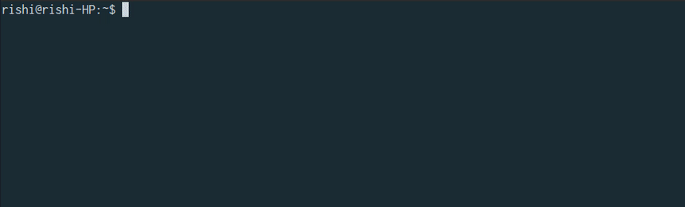

<h1 align="center">
  <br>
  
  <br>
  <a href="https://travis-ci.org/CodeDotJS/wolly">
  
  </a>
  <br>
</h1>

> :star: Downloading wallpapers through command line done right !

## Install

__`Required`[`NodeJS`](http://nodejs.org)`version :`__ __`>=4`__ 

```sh
$ npm install --global wolly
```
__`OR`__
```sh
$ sudo npm install --global wolly
```

## Preview

<p align="center">

</p>

## Usage 

```
 Usage   : wolly [command] <option>

 Global :
 wolly                  Downloads random wallpapers, everytime

 Command :
 -w,--wolly             Wallpaper Of The Day
 -d,--download          Paste wallpaper's link to download it

 Extra :
 -l,--link    [1]       URL of WallpaperOfTheDay
 -r,--random  [2]       Random URLs of beautiful wallpapers
 -b,--bulk    [3]       Get URLs of wallpaper in bulk

 Option :
 › Specify -1,-2 or -3 without any argument to print link in json
 › Specify --save after -1 or -2 to save links in a text file
 
 Tool :
 -h,--help              Show help
 -v,--version           Show current version

 Example :
 $ wolly -wolly         Downloads WallpaperOfTheDay
 $ wolly -1             Output the result as JSON
 $ wolly -2 --save      Export link in text file
```

## TODO

Some more features which I want to add -

__`✖`__ download wallpapers category wise like - `Laptop, Unicorns, Girls, Nature` 

__`✖`__ export `bulk links` in a file `( text/json )`

__`✖`__ method to export link obtained via `-l`, `-r`, `-b` to a `JSON file`

__`✖`__ switch to interactive mode to download wallpapers in bulk `(20 wallpapers at one time)`

__`✖`__ provide method to take `args` in `numbers` and download that amount of wallpaper `max : 20`

__`✖`__ provide method to set wallpapers as a current desktop wallpaper.

## Related

- __[`wolpi`](https://github.com/CodeDotJS/wolly-api)__ `:` `API for getting wallpaper's link.`

- __[`xkcd-comics`](https://github.com/CodeDotJS/xkcd-comics)__ `: Download random xkcd comic strips.`

- __[`kote`](https://github.com/CodeDotJS/kote)__ `: Daily injection of motivation, love and fun from command line.`


__`Wallpaper's Source`__ : __[`The WallpaperWall`](http://thepaperwall.com)__

## License

MIT &copy; [Rishi Giri](http://rishigiri.com)
